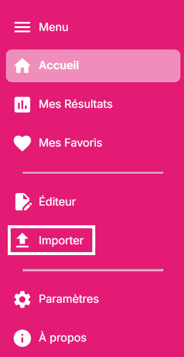
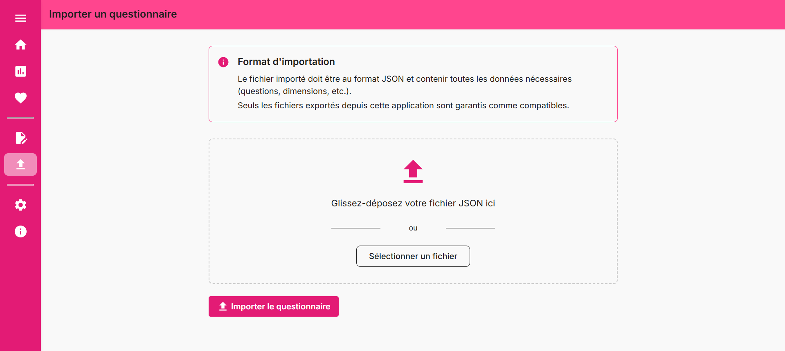
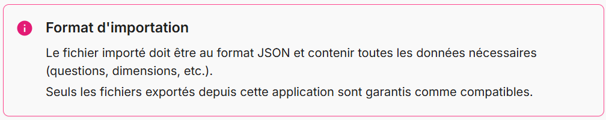
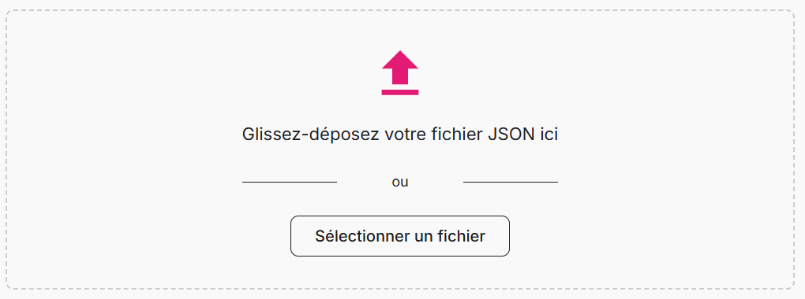
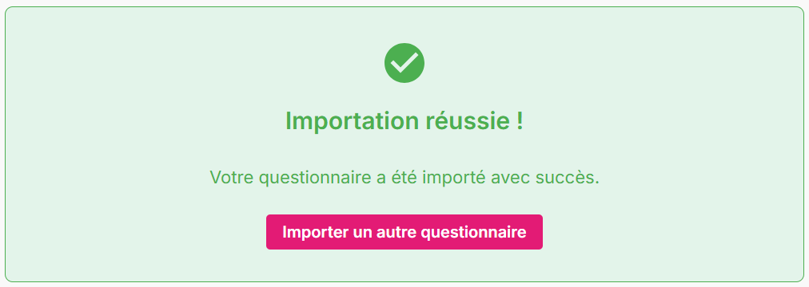
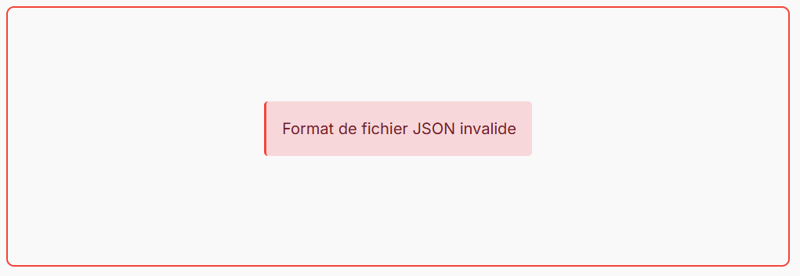

# Importation

Ce guide vous explique comment importer des questionnaires depuis des fichiers.

## Import de questionnaires

### Accéder à la page d'import

1. Dans le menu de navigation, cliquez sur **"Importer"** (📤)

2. Vous accédez à la page d'**importation de questionnaires**

### Format de fichier supporté

!!! info "Format de fichier"
    Seuls les fichiers .json exportés depuis cette application sont compatibles. Les autres formats ne sont pas supportés.

### Sélectionner un fichier

3. **Glissez-déposez** votre fichier dans la zone prévue ou **cliquez** pour sélectionner

### Lancer l'importation

4. Cliquez sur le bouton **"Importer"** pour commencer le processus

### Validation du fichier

5. Un **message de succès** confirme l'importation

### Erreurs de format

Si le fichier n'est pas compatible :

**Problèmes courants :**  
- Sélectionnez un fichier `.json`  
- Version incompatible  
- Structure de données incorrecte  

## Partage et collaboration

**Étapes pour recevoir :**  
1. **Récupérez** le fichier .json depuis l'expéditeur  
2. **Sauvegardez** sur votre appareil  
3. **Importez** via la page d'import  

## Prochaines étapes

### Navigation rapide

- **Continuer :** [Types de questionnaires →](02-types-questionnaires.md)
- **Aperçu :** [Retour à l'index](index.md)
- **Nettoyage de l'application :** [Réinitialisation](03-reinitialisation.md)

---

**Parfait !** Vous maîtrisez maintenant l'import de questionnaires. Découvrez comment [gérer les types de questionnaires](02-types-questionnaires.md) ! 📂